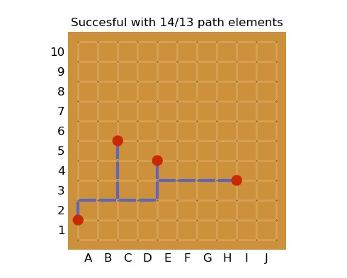

# Douro-boardgame
Implementation of a boardgame I call Douro (道路を築け, *Douro o kizuke*; lit. "build roads!" somewhat similar to existing game of Hashiwokakero (橋をかけろ *Hashi o kakero*; lit. "build bridges!").

The objective is not to play the game, but to write a function that successfully completes the 29 test scenarios given a fixed amount of path elements.

## Objective
Given is a `board` of 10 by 10 square tiles. The corners of these tiles may contain `pins`. The board contains 5 to 12 of these pins. The main objective of the game is to connect these pins. You connect this tile with `path elements`. These path elements can be placed on the edge between two tiles, so they always have a length of one. When all pins are connected the goal is to use as few path elements as possible.

## Tips

* This problem (finding the shortest route to reach all points) is called a Traveling Salesman Problem. However, there are two differences: You do not have to return to where you started, and "walking back" over a `path` is not double counted.
* This way of calculating distance over a grid is called "Manhattan Distance" or the L1 distance.
* The difference with Hashi is that roads are allowed to cross and are of fixed length.

## Code definitions
* `board`: `points` on the board consist of an x and y component. Since the matrix consists of 10 tiles in both directions, the minimum of the x and y components is 0, and the maximum is 11. Points may not contain decimals.
* `pin`: a pin has only one point for example `(3, 4)`.
* `pins` is a `list` consisting of `pin` elements.
* `path_element`: consists of a start point and an end point, the order does not matter. The Manhattan distance between the start point and end point must always be 1. For example `((3, 4), (4, 4))`.
* `paths` is a `list` consisting of `path_elements`.

## Already implemented
Many functions are already implemented so you can focus on the path algorithm, in order of importance:
* `display_board`, here you can throw paths and pins into it and it visualizes it for you.
* `validate_paths`, throw a path in here, it checks it for all the above rules, that helps you with debugging. This function returns nothing, but only raises an error when something is wrong.
* `get_clusters`, walks all your paths and labels contiguous parts. If only one label appears in your pins you know you have reached all pins.

## Task description.
In order of urgency:
1. Write your solution `find_paths`.
2. To see which scenarios your solution works for edit `set_pins`.
3. Improve your performance estimation by extending the use of `score_solution`.  

## Testing
Finally, your solution will be tested a test set of 29 scenarios from the booklet that Thomas took pictures of. The results will first be ranked by number of successful connections. For an equal number of successful connections, the sum over all paths used will be taken.

